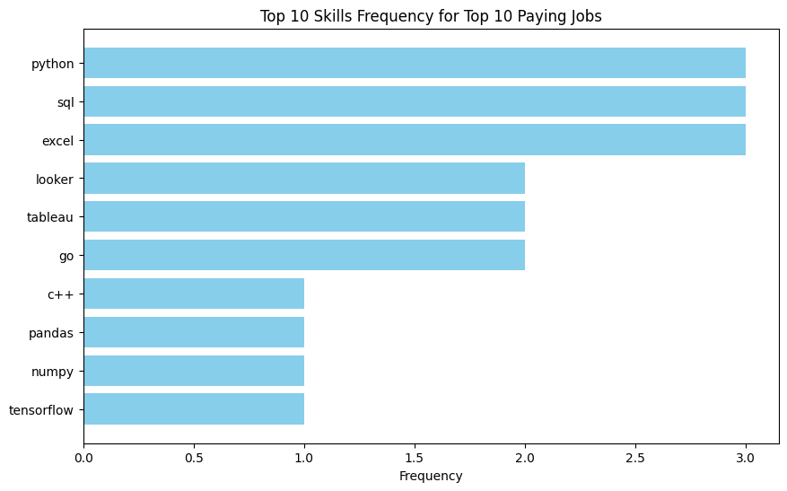

# Introduction

Dive into the 📊 data job market! Focusing on data analyst roles, this project explores 💰 top-paying jobs, 🔥 in-demand skills, and where high demand meets high salary in data analytics. 🚀

🔍 SQL queries can be found here: [project_sql folder](/project_sql/)

# Background


Fueled by a quest to navigate the data analyst job market more effectively, this project emerged from the desire to pinpoint top-paid 🔝💰 and in-demand skills, and to uncover optimal job opportunities. 🚀📊


### The questions I wanted to answer through my SQL queries were:

1. What are the top-paying data analyst jobs?
2. What skills are required for these top-paying jobs?
3. What skills are most in demand for data analysts?
4. Which skills are associated with higher salaries?
5. What are the most optimal skills to learn?

# Tools I Used

For my deep dive into the data analyst job market, I harnessed the power of several key tools:

- **SQL:** The backbone of my analysis, allowing me to query the database and unearth critical insights.
- **PostgreSQL:** The chosen database management system, ideal for handling the job posting data.
- **Visual Studio Code:** My go-to for database management and executing SQL queries.
- **Git & GitHub:** Essential for version control and sharing my SQL scripts and analysis, ensuring collaboration and project tracking.

# The Analysis

Each query for this project aimed at investigating specific aspects of the data analyst job market. Here’s how I approached each question:

### 1. Top Paying Data Analyst Jobs in London, UK
To identify the highest-paying roles, I filtered data analyst positions by average yearly salary and location, focusing on jobs in London, UK. This query highlights the high paying opportunities in the field.
```sql
SELECT
    job_id,
    job_title,
    job_location,
    job_schedule_type,
    salary_year_avg,
    job_posted_date,
    name AS company_name
FROM
    job_postings_fact
    LEFT JOIN company_dim ON job_postings_fact.company_id = company_dim.company_id
WHERE
    job_title_short LIKE 'Data Analyst'
    AND job_location LiKE '%London% UK'
    AND salary_year_avg IS NOT NULL
ORDER BY
    salary_year_avg DESC
LIMIT
    10
```

**Table Summary: Top Data Jobs in London, UK**

This table showcases high-paying data job opportunities in London, UK, featuring a range of roles and salary averages. From prestigious companies like DeepMind and Logispin to NBCUniversal and Energy Aspects Ltd, this list provides insights into the current data job market landscape.


- **London, UK's data job** market offers lucrative opportunities with competitive salaries.
- **Roles span** from research engineering to analytics, with companies like DeepMind and Logispin leading the pack.
- **Demand** for data professionals is evident, as indicated by postings from prestigious companies like NBCUniversal and Energy Aspects Ltd.


*Bar graph showing the top 10 Data Analyst job titles along with their respective average salaries.*

### 2. Skills for Top Paying Jobs
To understand what skills are required for the top-paying jobs, I joined the job postings with the skills data, providing insights into what employers value for high-compensation roles.
```sql
WITH top_paying_jobs AS (
    SELECT
        job_id,
        job_title,
        salary_year_avg,
        job_posted_date,
        name AS company_name
    FROM
        job_postings_fact
        LEFT JOIN company_dim ON job_postings_fact.company_id = company_dim.company_id
    WHERE
        job_title_short LIKE 'Data Analyst'
        AND job_location LiKE '%London%'
        AND salary_year_avg IS NOT NULL
    ORDER BY
        salary_year_avg DESC
    LIMIT
        10
)
SELECT
    top_paying_jobs.*,
    skills
FROM
    top_paying_jobs
    INNER JOIN skills_job_dim ON top_paying_jobs.job_id = skills_job_dim.job_id
    INNER JOIN skills_dim ON skills_job_dim.skill_id = skills_dim.skill_id
ORDER BY
    salary_year_avg DESC
```
Here's the breakdown of the most demanded skills for the top 10 highest paying data analyst jobs in London, UK, for 2023:

- **SQL:** A fundamental skill for data professionals, SQL (Structured Query Language) is used for managing and querying relational databases, crucial for data extraction and analysis tasks.

- **Python:** Widely used across different roles, Python is a versatile programming language crucial for data manipulation, analysis, and machine learning tasks.

- **Excel:** Excel proficiency is essential for various data-related tasks, including data cleaning, analysis, visualization, and reporting.

- **Tableau:** A popular data visualization tool, Tableau enables users to create interactive and insightful dashboards, valuable for communicating data insights to stakeholders.

- **Looker:** Looker is a business intelligence platform used for data visualization, exploration, and analytics, valuable for roles involving data-driven decision-making.



*Bar graph visualizing the count of skills for the top 10 paying jobs for Data Analysts in London, UK.*

### 3. In-Demand Skills for Data Analysts
This query helped identify the top 5 in-demand skills for Data Analyst remote jobs.
```sql
WITH remote_job_skills AS (
    SELECT
        skill_id,
        COUNT(*) AS skill_count
    FROM
        skills_job_dim AS skills_to_job
        INNER JOIN job_postings_fact AS job_postings ON job_postings.job_id = skills_to_job.job_id
    WHERE
        job_postings.job_work_from_home = TRUE
        AND job_title_short LIKE 'Data Analyst'
    GROUP BY
        skill_id
)
SELECT
    skills.skill_id,
    skills AS skill_name,
    skill_count
FROM
    remote_job_skills
    INNER JOIN skills_dim AS skills ON skills.skill_id = remote_job_skills.skill_id
ORDER BY
    skill_count DESC
LIMIT
    5;
```
| Skills     | Demand Count|
|------------|-------------|
| sql        | 7291        |
| excel      | 4611        |
| python     | 4330        |
| tableau    | 3745        |
| power bi   | 2609        |

*Table of the demand for the top 5 skills in Data Analyst remote job postings.*

### 4. Skills Based on Salary
Exploring the average salaries associated with different skills revealed which skills are the highest paying.
```sql
SELECT
    skills,
    ROUND(AVG(salary_year_avg), 0) AS avg_salary
FROM
    job_postings_fact
    INNER JOIN skills_job_dim ON job_postings_fact.job_id = skills_job_dim.job_id
    INNER JOIN skills_dim ON skills_job_dim.skill_id = skills_dim.skill_id
WHERE
    job_postings_fact.job_work_from_home = TRUE
    AND job_title_short LIKE 'Data Analyst'
    AND salary_year_avg IS NOT NULL
GROUP BY
    skills
ORDER BY
    avg_salary DESC
LIMIT
    10
```
Here are some insights into trends based on the top-paying skills for data analysts:
- Big Data Technologies Dominate: Skills like PySpark, Elasticsearch, Databricks, and Kubernetes indicate a significant demand for handling large volumes of data efficiently. This suggests that companies are increasingly investing in big data solutions and cloud-based infrastructure to manage and analyze data at scale.
- Focus on Data Science and Machine Learning: Skills such as Pandas, NumPy, Scikit-learn, and Jupyter are essential for data manipulation, analysis, and machine learning tasks. This trend underscores the growing importance of data science and machine learning in various industries, as companies strive to derive insights and value from their data to make informed decisions.
- DevOps and Version Control Tools Gain Traction: Tools like Bitbucket, GitLab, Jenkins, and Atlassian reflect the integration of DevOps practices in data analytics workflows. As organizations aim for more automation, collaboration, and reproducibility in their data projects, proficiency in version control systems and continuous integration/continuous deployment (CI/CD) pipelines becomes increasingly valuable for data analysts.

| Skills         | Average Salary ($) |
|----------------|--------------------|
| pyspark        | $208,172           |
| bitbucket      | $189,155           |
| couchbase      | $160,515           |
| watson         | $160,515           |
| datarobot      | $155,486           |
| gitlab         | $154,500           |
| swift          | $153,750           |
| jupyter        | $152,777           |
| pandas         | $151,821           |
| elasticsearch  | $145,000           |

*Table of the average salary for the top 10 paying skills for Data Analysts.*

### 5. Most Optimal Skills to Learn
Combining insights from demand and salary data, this query aimed to pinpoint skills that are both in high demand and have high salaries, offering a strategic focus for skill development.
```sql
WITH skills_demand AS (
    SELECT
        skills_dim.skill_id,
        skills_dim.skills,
        COUNT(skills_job_dim.job_id) AS demand_count
    FROM
        job_postings_fact
        INNER JOIN skills_job_dim ON job_postings_fact.job_id = skills_job_dim.job_id
        INNER JOIN skills_dim ON skills_job_dim.skill_id = skills_dim.skill_id
    WHERE
        job_title_short LIKE 'Data Analyst'
        AND salary_year_avg IS NOT NULL
        AND job_work_from_home = TRUE
    GROUP BY
        skills_dim.skill_id
),
average_salary AS (
    SELECT
        skills_job_dim.skill_id,
        ROUND(AVG(salary_year_avg), 0) AS avg_salary
    FROM
        job_postings_fact
        INNER JOIN skills_job_dim ON job_postings_fact.job_id = skills_job_dim.job_id
        INNER JOIN skills_dim ON skills_job_dim.skill_id = skills_dim.skill_id
    WHERE
        job_title_short LIKE 'Data Analyst'
        AND salary_year_avg IS NOT NULL
        AND job_work_from_home = TRUE
    GROUP BY
        skills_job_dim.skill_id
)
SELECT
    skills_demand.skill_id,
    skills_demand.skills,
    skills_demand,
    avg_salary
FROM
    skills_demand
    INNER JOIN average_salary ON skills_demand.skill_id = average_salary.skill_id
WHERE demand_count > 10
ORDER BY
     avg_salary DESC,
    demand_count DESC
LIMIT 10;
```
| Skill ID | Skills      | Skills Demand | Average Salary ($)|
|----------|-------------|---------------|----------------|
| 8        | go          | 27            | $115,320       |
| 234      | confluence  | 11            | $114,210       |
| 97       | hadoop      | 22            | $113,193       |
| 80       | snowflake   | 37            | $112,948       |
| 74       | azure       | 34            | $111,225       |
| 77       | bigquery    | 13            | $109,654       |
| 76       | aws         | 32            | $108,317       |
| 4        | java        | 17            | $106,906       |
| 194      | ssis        | 12            | $106,683       |
| 233      | jira        | 20            | $104,918       |
*Table of the most optimal skills for Data Analyst sorted by salary.*

Here's a breakdown of the most optimal skills for Data Analysts in 2023:

- **High-Demand Programming Languages:** Python and R stand out for their high demand, with demand counts of 236 and 148 respectively. Despite their high demand, their average salaries are around $101,397 for Python and $100,499 for R, indicating that proficiency in these languages is highly valued but also widely available.
- **Cloud Tools and Technologies:** Skills in specialized technologies such as Snowflake, Azure, AWS, and BigQuery show significant demand with relatively high average salaries, pointing towards the growing importance of cloud platforms and big data technologies in data analysis.
- **Business Intelligence and Visualization Tools:** Tableau and Looker, with demand counts of 230 and 49 respectively, and average salaries around $99,288 and $103,795, highlight the critical role of data visualization and business intelligence in deriving actionable insights from data.
- **Database Technologies:** The demand for skills in traditional and NoSQL databases (Oracle, SQL Server, NoSQL) with average salaries ranging from $97,786 to $104,534, reflects the enduring need for data storage, retrieval, and management expertise.

# Overall Impact:
- This project served as a pivotal opportunity for me to delve deeper into the intricacies of the data analyst job market, particularly in London, UK.
- By employing SQL queries extensively, I honed my proficiency in database management and querying, enabling me to extract actionable insights from complex datasets efficiently.
- The project provided invaluable insights into the technical skills sought after in the data analyst field, empowering me with knowledge essential for career growth and advancement.
- Analyzing the data allowed me to identify trends and patterns, emphasizing the critical role of technical competencies such as SQL, Python, Excel, Tableau, and Looker in securing high-paying data analyst roles.

# Personal Impact:
- Practicing SQL queries extensively enhanced my database querying skills, enabling me to manipulate and analyze large datasets with precision and efficiency.
- Exploring the top-paying roles deepened my understanding of technical skills such as SQL, Python, and Excel, as well as visualization tools like Tableau and Looker, enriching my technical repertoire in the data analyst domain.
- Investigating in-demand skills for data analysts broadened my knowledge of essential technical competencies like SQL, Excel, Python, Tableau, and Power BI, providing me with a comprehensive understanding of the skill landscape in the industry.
- Analyzing skills based on salary trends allowed me to gain insights into emerging technologies such as big data platforms, data science libraries, and DevOps tools, expanding my expertise in cutting-edge technologies relevant to data analysis.
- Identifying the most optimal skills to learn based on demand and salary data equipped me with strategic insights for skill development, guiding me towards mastering high-demand technical skills like Go, Java, Snowflake, AWS, and Confluence in the data analyst field.

# Conclusions
## Insights

From the analysis, several general insights emerged:

1. **Top Paying Data Analyst Jobs in London, UK**: Through SQL queries, the project identifies top-paying data analyst roles in London, UK, showcasing lucrative opportunities from prestigious companies like DeepMind and NBCUniversal.

2. **Skills for Top Paying Jobs**: By analyzing the skills required for the top-paying roles, the project highlights the importance of SQL, Python, Excel, Tableau, and Looker in the data analyst job market.

3. **In-Demand Skills for Data Analysts**: The query reveals the top 5 in-demand skills for remote data analyst jobs, emphasizing SQL, Excel, Python, Tableau, and Power BI as essential skills for aspiring data analysts.

4. **Skills Based on Salary**: Exploring the average salaries associated with different skills uncovers trends favoring big data technologies, data science, machine learning, DevOps, and version control tools among data analysts.

5. **Most Optimal Skills to Learn**: By combining demand and salary data, the project identifies high-demand, high-paying skills for data analysts, including programming languages like Go and Java, cloud technologies like Snowflake and AWS, and database technologies like Confluence and Hadoop.

## Closing Thoughts

This project enhanced my SQL skills and provided valuable insights into the data analyst job market. The findings from the analysis serve as a guide to prioritizing skill development and job search efforts. Aspiring data analysts can better position themselves in a competitive job market by focusing on high-demand, high-salary skills. This exploration highlights the importance of continuous learning and adaptation to emerging trends in the field of data analytics.